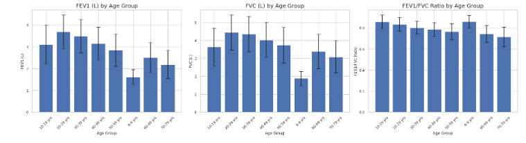
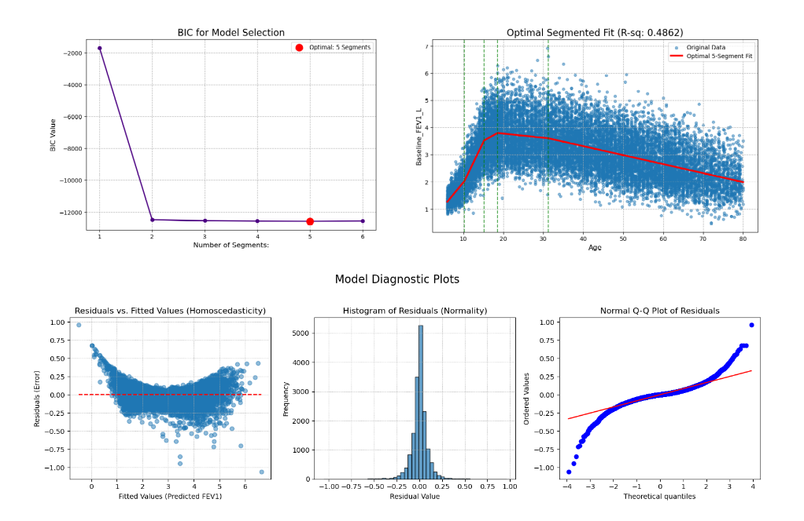

# Spirometry Modeling: Segmented Regression
 
Implementation of segmented regression to model spirometry measures with Exploratoory Data Analysis EDA, feature engineering for clinical data interpretation.

###  Objective 

The project focuses on:
- Modeling lung function (FEV1, FVC, FEV1/FVC) using demographic and anthropometric predictors  
- Implementing segmented (piecewise) linear regression  

 Methods Summary
- **Exploratory analysis:** distributions, boxplots, stratified comparisons  
- **Feature set:** age, height, weight, BMI, transformations & interactions  
- **Segmented Linear Regression:** estimating breakpoints in age  
- **Model Selection:** via BIC and LASSO-based feature screening  
- **Validation:** residual analysis

### Dataset
[Refined NHANES Spirometry (publicly available)](https://data.mendeley.com/datasets/dwjykg3xww/1) 
 Contributor: Gerald Zavorsky

### Highlights

##### Exploratory Data Analysis
### Dataset  Overview
(based on information provided on dataset website on Mendeley)

| Feature | Detail/Range | Notes |
| :--- | :--- | :--- |
| **Data Source** | National Health and Nutrition Examination Survey (NHANES) | Secondary data utilization. |
| **Survey Years** | 2007 - 2012 | Period of NHANES data used. |
| **Initial Participants** | 31,451 | Total participants in the initial NHANES pool. |
| **Refined Participants (Spirometry)** | **16,596** | Participants meeting technical quality standards. |
| **Age Range** | 6 - 80 years | Age of included participants. |
| **Racial/Ethnic Backgrounds** | Diverse | Study represents various racial and ethnic groups. |
| **Weight Range** | 16.4 - 218.2 kg | Range of participant weights. |
| **Height Range** | 104.6 - 203.8 cm | Range of participant heights. |
| **BMI Range** | 12.5 - 84.9 kg/m² | Range of participant Body Mass Index. |
| **Spirometry Quality Standard** | American Thoracic Society (2005) | Minimum technical quality standards (A and B maneuvers). |
| **Secondary Analysis** | Z-scores, Restrictive Pattern, Airway Obstruction | Calculated from GAMLSS and piecewise regression models using Lower Limit of Normal (LLN). |

[See  **01. Exploratory Data Analysis** For EDA Details](https://github.com/darshanz/spirometry-risk-prediction-nhanes/blob/main/notebooks/01_Exploratory%20Data%20Analysis.ipynb)

#### Segmented Regression (SLR):

- Included the squared age term to facilitate estimation of breakpoints across the 5–80 year age range.

- Breakpoints and their 95% confidence intervals were identified using a combination of visual inspection and iterative methods.

- LASSO regression was applied to select important predictors, including age, height, weight, interaction terms, and squared terms, guided by the **Bayesian Information Criterion (BIC)**.

- Models were assessed for multicollinearity, outliers, and adherence to underlying assumptions.

[See **02. Segmented Linear Regression** for details.](https://github.com/darshanz/spirometry-risk-prediction-nhanes/blob/main/notebooks/02.%20Segmented%20Linear%20Regression.ipynb)

#### Note: 
The methodology in used in this repo is based on the experiments described in the following paper. Instead of R pckages used in the orgiginal study python alternatives have been used.

**“A refined spirometry dataset for comparing segmented (piecewise) linear models to that of GAMLSS.”**  
PubMed: https://pubmed.ncbi.nlm.nih.gov/39736902/

### Acknowledgements
Dataset curators of the 2024 refined NHANES spirometry dataset and authors of the comparison study.
